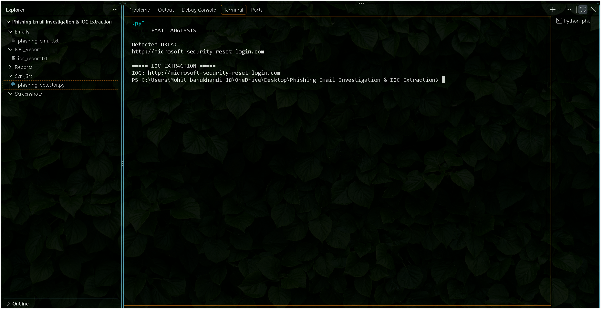
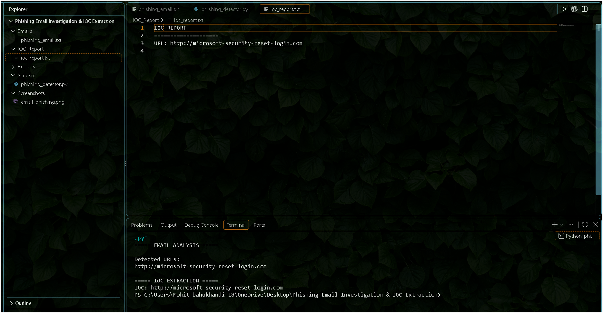
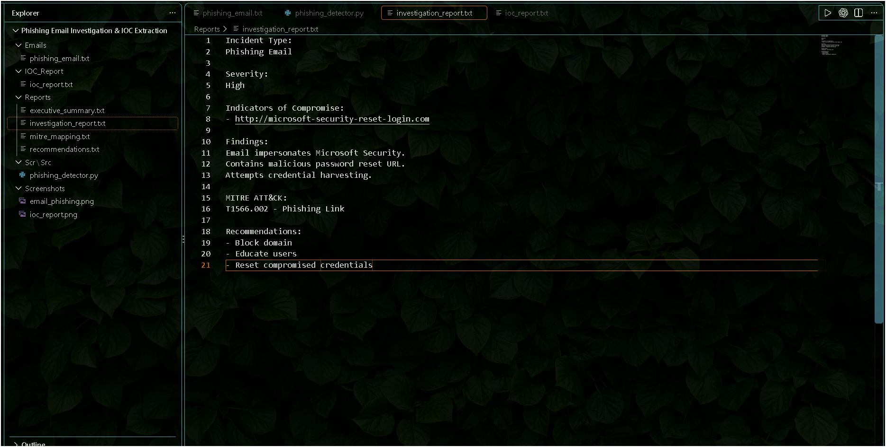

# Phishing Email Investigation & IOC Extraction

A SOC-focused cybersecurity project designed to investigate phishing emails, extract Indicators of Compromise (IOCs), map findings to the MITRE ATT&CK framework, and generate investigation reports.

The project demonstrates email analysis, IOC extraction, threat investigation, phishing detection, and incident documentation workflows commonly performed by Security Operations Center (SOC) Analysts.

## Skills Demonstrated

- Phishing Email Analysis
- IOC Extraction
- Threat Investigation
- MITRE ATT&CK Mapping
- Incident Reporting
- Cyber Threat Detection
- Security Analysis
- Python Automation

## Investigation Workflow

1. Collect Suspicious Email
2. Analyze Email Content
3. Extract URLs
4. Identify Indicators of Compromise
5. Assess Phishing Risk
6. Map Findings to MITRE ATT&CK
7. Generate Reports
8. Document Incident

## Indicators of Compromise

| IOC Type | Value |
|-----------|--------|
| URL | http://microsoft-security-reset-login.com |
| Technique | T1566.002 |

## Incident Summary

A phishing email impersonating Microsoft Security was identified.

Severity: High

The email attempted to convince the victim to reset credentials through a suspicious URL.

MITRE Technique:
T1566.002 – Spearphishing Link

Recommended Actions:

- Block malicious domain
- Reset affected credentials
- Enable MFA
- Conduct awareness training

## MITRE ATT&CK Mapping

| Technique ID | Technique Name | Tactic |
|--------------|---------------|---------|
| T1566.002 | Spearphishing Link | Initial Access |

## Project Screenshots

### Email Analysis

### IOC Report

### Investigation Report

## Future Improvements

- Domain Reputation Lookup
- VirusTotal Integration
- Email Header Analysis
- Sender Reputation Checks
- Automated Threat Intelligence Enrichment
- Real-Time Phishing Detection

## 

| IOC Type | |	Value |	| Reason |
|--Email--| |--	security@microsoft-alerts.com--| |--Suspicious sender--|
|--Domain--| |--microsoft-security-reset-login.com	--||--Brand impersonation--|
|--URL--|	|--http://microsoft-security-reset-login.com--|	|--Credential harvesting--|
|--MITRE--|	|--T1566.002--|	|--Spearphishing Link--|
